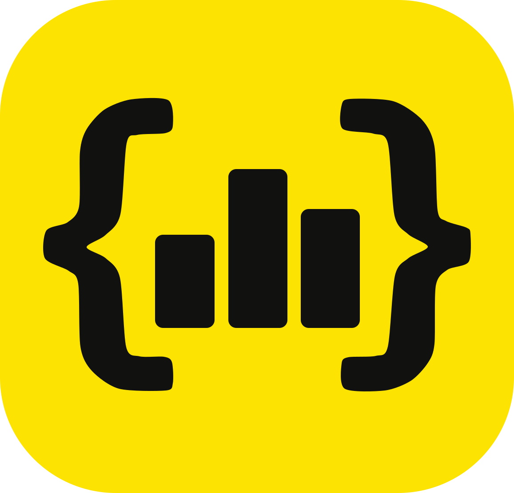
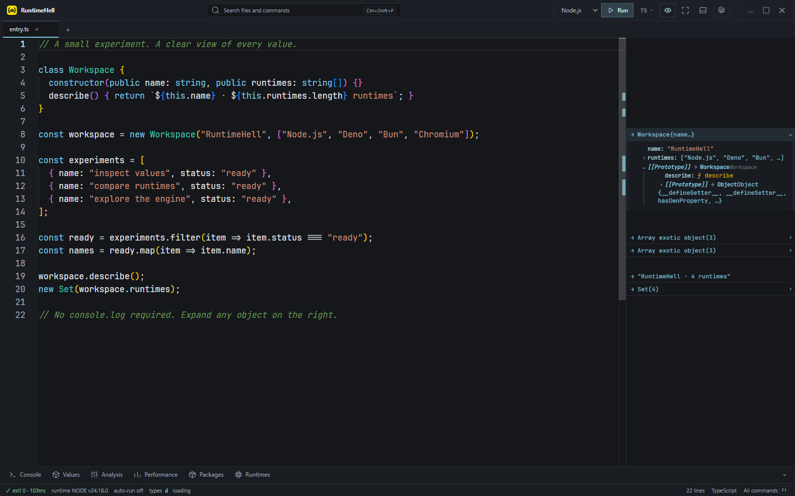
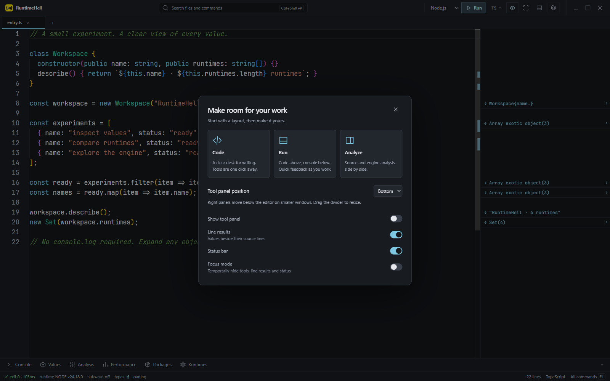
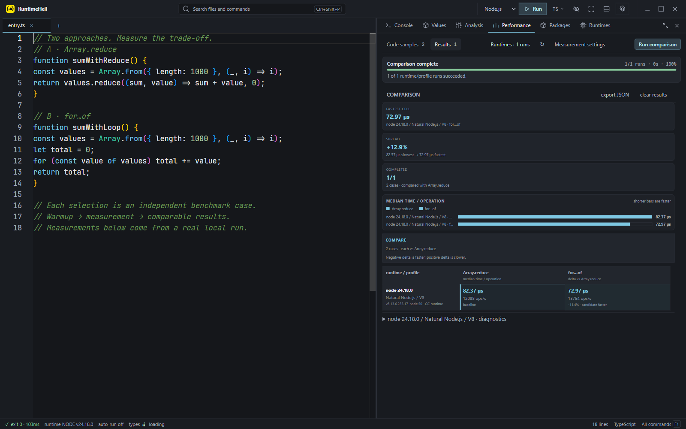

<div align="center">
  

  # RuntimeHell

  **A multi-runtime JavaScript and TypeScript workbench for execution, engine analysis, and performance experiments.**

  [English](README.md) · [Русский](README.ru.md)

  
  [](https://github.com/mr-lexus/RuntimeHell/actions/workflows/ci.yml)
  
  
  
</div>

> [!WARNING]
> **RuntimeHell is beta software.** Main workflows are ready for testing, but bugs and platform-specific limitations remain possible. Installers are unsigned and macOS builds are not notarized. Keep backups of important workspaces and run only code you trust.

RuntimeHell is a Windows-first desktop playground for developers who want to run the same JavaScript or TypeScript across different runtimes, inspect what an engine does with the code, and compare performance without leaving one workspace.

## Beta downloads

**[Visit the product website](https://mr-lexus.github.io/RuntimeHell/)** · **[Download 0.1.0-beta.1](https://github.com/mr-lexus/RuntimeHell/releases/tag/v0.1.0-beta.1)**

Native GitHub Actions builds provide Windows x64 (NSIS), macOS Intel/Apple Silicon (DMG/ZIP), and Linux x64 (AppImage/DEB). Each release includes SHA-256 checksums. Builds are currently unsigned and macOS packages are not notarized.

### Release pipeline

Pushing a version tag such as `v0.1.0-beta.1` starts the release workflow. It validates the version, runs lint/typecheck/tests, builds on native Windows, Linux, and macOS runners, then uploads all installers to a draft before publishing the prerelease. The regular [CI workflow](.github/workflows/ci.yml) also checks pushes and pull requests.

| Platform | Runner | Artifacts |
| --- | --- | --- |
| Windows x64 | `windows-latest` | NSIS `.exe` installer |
| Linux x64 | `ubuntu-latest` | AppImage and DEB |
| macOS x64 | `macos-15-intel` | DMG and ZIP |
| macOS arm64 | `macos-14` | DMG and ZIP |

See [platform compatibility](docs/platform-compatibility.md) for the tested native paths, runtime discovery behavior, and known engine limitations.



## What is available in the beta

### Multi-runtime execution

- Run JavaScript and TypeScript with **Node.js**, **Deno**, **Bun**, or the embedded **Chromium** lane.
- Select system or managed runtime versions from the workbench.
- Stream stdout, stderr, structured console values, per-line output, exit status, and duration while a run is active.
- Cancel long-running code and enforce a configurable timeout with child-process tree cleanup.
- Inspect captured values as an expandable, virtualized object tree.
- Inspect top-level objects without `console.log`, including destructured bindings, multiple values per line, hidden/symbol properties and prototype chains. Accessors are displayed without invocation.

### Editor and workspace

- Monaco-based editor with multiple tabs, TypeScript language tooling, formatting, folding, and bracket-pair colorization.
- Automatic type acquisition for imported packages.
- Autosave, session restore, run history, command palette, and optional auto-run.
- Optional Vim/Neovim editing powered by `monaco-vim`, with a documented LazyVim keymap profile, which-key hints, and RuntimeHell-native buffer/file/diagnostic actions.
- Compact Code/Run/Analyze layouts, dock positioning, focus mode, searchable settings, density and motion preferences.



### Engine internals

Inspect code with **V8 / d8**, **SpiderMonkey**, and **JavaScriptCore** adapters. Depending on the selected engine and its capabilities, RuntimeHell can expose:

- AST;
- bytecode;
- optimized machine code;
- IR graphs;
- deoptimization traces;
- garbage-collection traces.

Analysis can target the whole module or an individual function. Results provide normalized views where available while retaining the raw engine output for verification. Compatible engine binaries must be installed or imported separately.

### Runtime and package management

- Detect system installations of Node.js, Deno, Bun, Chrome, Firefox, and nvm-managed Node versions.
- Download supported managed runtime/engine builds, track versions in a manifest, and import existing local binaries.
- Browse the wider runtime and engine catalog, including experimental entries whose execution adapters may not be complete yet.
- Search the npm registry and install, update, pin, or remove dependencies per workspace.
- Package install scripts are ignored by default; the npm log remains visible for inspection.
- Insert imports from the installed package's README, optionally add a commented example, and undo the entire insertion in one step. No automatic execution on insertion.

### Performance Lab

- Turn the active file or editor selection into one or more benchmark cases.
- Run every case through a configurable runtime × optimizer-profile matrix.
- Control warmup, samples, iterations, timeout, and GC policy, or use quick/reliable presets.
- Compare median, mean, p95, p99, standard deviation, throughput, paired deltas, and warnings.
- Export experiment results as JSON.



## Quick start

Download an installer above, or run from source. The primary development target is **Windows 10/11 x64**, with native macOS and Linux release builds.

### Requirements (from source)

- Node.js 24
- pnpm 12.8.1 (see `packageManager`)
- Git

```sh
pnpm install
pnpm dev
```

The app opens with an executable TypeScript analysis demo. Press `Ctrl+Enter` (`Cmd+Enter` on macOS) or use the Run button to execute it. Install or select additional runtimes and analysis engines from the **Runtimes** panel.

## Platform compatibility

The main execution path, native config/cache directories, runtime discovery, PATH handling, process cancellation, and Node/Deno/Bun archive formats are selected at runtime for Windows, macOS, and Linux. Optional engine downloads remain availability-dependent: V8 canary packages are enabled for Windows x64, Linux x64, and Intel macOS; SpiderMonkey, JavaScriptCore, and several standalone engines still require a Windows x64 build or a local import. See the [detailed compatibility matrix](docs/platform-compatibility.md).

## Development

| Command | Purpose |
| --- | --- |
| `pnpm dev` | Start Electron with hot reload |
| `pnpm brand:icons` | Regenerate PNG/ICO assets after editing `logo.svg` |
| `pnpm lint` | Run repository architecture and lint gates |
| `pnpm typecheck` | Type-check protocol, main, preload, and renderer packages |
| `pnpm typecheck:all` | Also type-check the shared engine parsers |
| `pnpm test` | Run the Vitest unit and integration suites |
| `pnpm build` | Build the main process, preload bridge, renderer, and runtime assets |

## Project layout

| Path | Responsibility |
| --- | --- |
| `apps/main` | Electron main process, execution, runtimes, engines, packages, persistence, and performance |
| `apps/preload` | Narrow validated bridge between Electron and the renderer |
| `apps/renderer` | React, Monaco, Zustand stores, panels, and application UI |
| `packages/protocol` | Shared Zod IPC contracts and types |
| `packages/engine-parsers` | Pure engine-output parsers and fixtures |
| `docs` | Security, platform compatibility, engine licensing, custom-build, and troubleshooting notes |

## Security

> [!CAUTION]
> RuntimeHell isolates runs from the Electron UI, but it is **not a security sandbox**. Executed code runs with your user account's privileges and may access the filesystem or network. Only run code and install packages that you trust.

The renderer uses context isolation, sandboxing, and validated IPC contracts. Runtime processes have bounded timeouts and process-tree cancellation; managed downloads use official sources and checksum verification where upstream checksums are available. See [the threat model](docs/threat-model.md) for the exact guarantees and non-guarantees.

## Beta limitations

- Windows is the primary development platform; packaged beta builds are also produced and smoke-tested on macOS and Linux.
- Runtime and engine availability varies by architecture, installed software, network access, and upstream releases.
- Not every catalog entry has a finished execution or analysis adapter.
- Some analysis modes require debug or custom engine builds and are unsupported by release binaries.
- UI behavior, IPC contracts, workspace metadata, and benchmark formats may change before stable release.

Bug reports with reproduction steps, runtime/engine versions, and relevant raw output are especially valuable during the beta phase.
