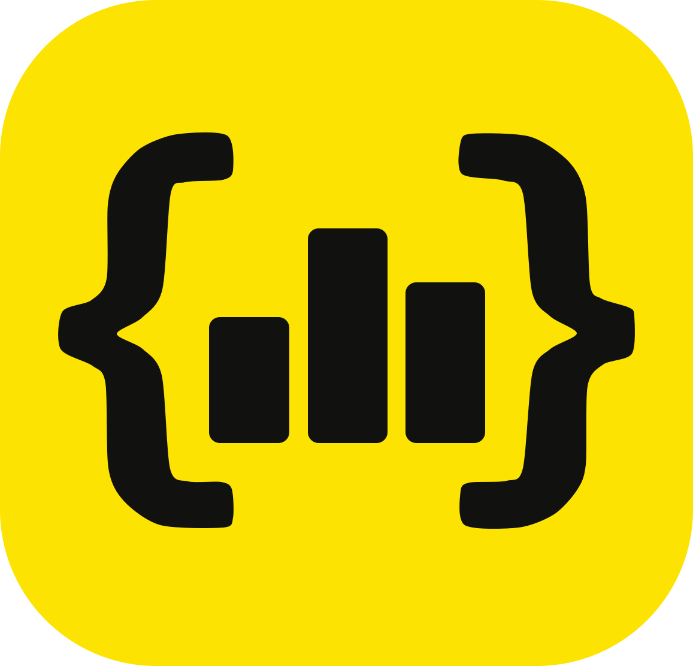
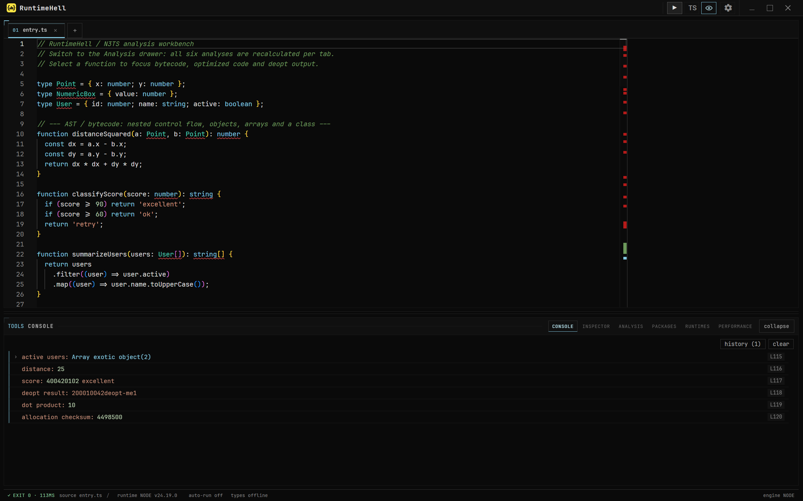
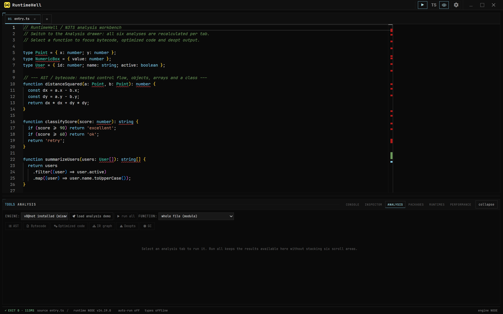
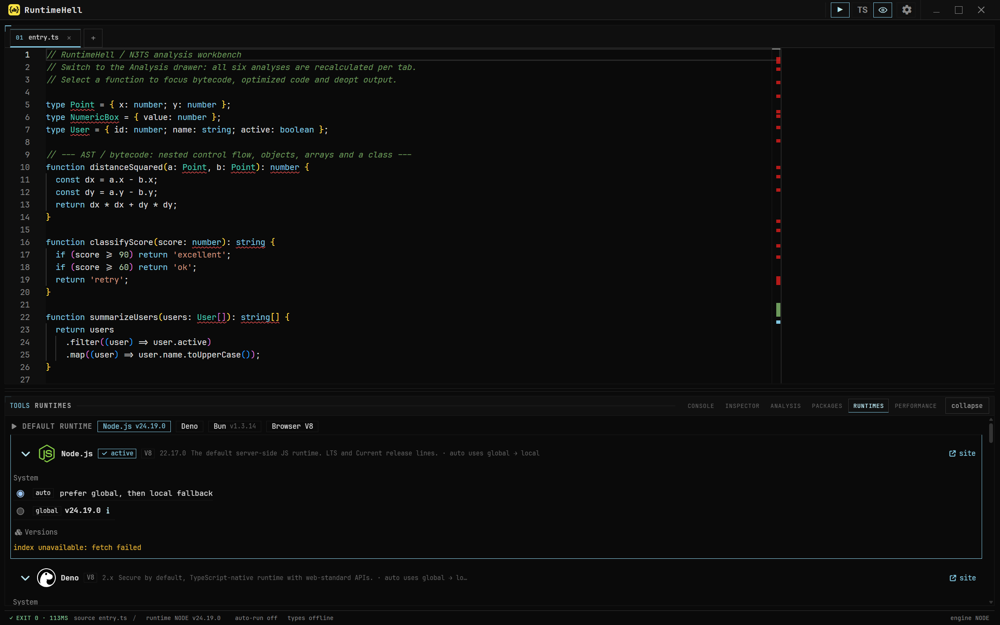
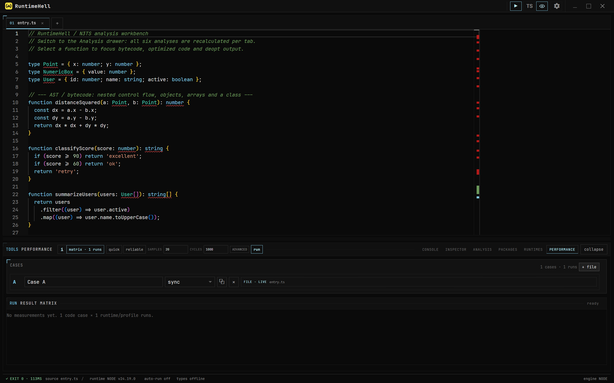

<div align="center">
  

  # RuntimeHell

  **Среда для запуска JavaScript и TypeScript в разных runtime-средах, анализа движков и экспериментов с производительностью.**

  [English](README.md) · [Русский](README.ru.md)

  
  [](https://github.com/mr-lexus/RuntimeHell/actions/workflows/ci.yml)
  
  
  
</div>

> [!WARNING]
> **RuntimeHell находится в альфа-версии.** Некоторые возможности могут быть недоделаны, работать нестабильно или быть недоступны на отдельных компьютерах; интерфейсы и форматы сохранённых данных могут изменяться без предупреждения. Интеграция с runtime-средами и движками также зависит от локально установленных инструментов и доступности внешних бинарных сборок. Не используйте эту версию для критически важных задач и сохраняйте резервные копии рабочих файлов.

RuntimeHell — Windows-first приложение для разработчиков, которым нужно запускать один и тот же JavaScript или TypeScript в разных runtime-средах, исследовать внутреннюю работу движков и сравнивать производительность в едином рабочем пространстве.

## Загрузки альфа-версии

Каждый alpha-тег собирается через GitHub Actions для Windows x64 (NSIS-инсталлятор), macOS Intel и Apple Silicon (DMG/ZIP), а также Linux x64 (AppImage/DEB). Инсталляторы доступны на странице [GitHub Releases](https://github.com/mr-lexus/RuntimeHell/releases). Сейчас сборки не подписываются, а пакеты macOS не проходят notarization.

### Процесс релиза

Отправка тега версии, например `v0.1.0-alpha.0`, запускает release-workflow. Он проверяет alpha-версию, выполняет lint/typecheck/тесты, собирает приложение на нативных runner'ах Windows, Linux и macOS и публикует черновик GitHub prerelease после успешной сборки всех платформ. Обычный [CI-workflow](.github/workflows/ci.yml) выполняет те же проверки и дополнительные smoke-тесты совместимости для pull request'ов и push в `main`/`master`.

| Платформа | Runner | Артефакты |
| --- | --- | --- |
| Windows x64 | `windows-latest` | NSIS-инсталлятор `.exe` |
| Linux x64 | `ubuntu-latest` | AppImage и DEB |
| macOS x64 | `macos-15-intel` | DMG и ZIP |
| macOS arm64 | `macos-14` | DMG и ZIP |

Подробности о нативных путях, обнаружении runtime-сред и известных ограничениях движков собраны в документе [совместимость платформ](docs/platform-compatibility.md).



## Что уже доступно в альфа-версии

### Запуск в разных runtime-средах

- Запуск JavaScript и TypeScript через **Node.js**, **Deno**, **Bun** или встроенный **Chromium**.
- Выбор системных и управляемых версий runtime прямо в рабочем окне.
- Потоковое отображение stdout, stderr, структурированных значений консоли, результатов по строкам, кода завершения и длительности запуска.
- Отмена зависших запусков, настраиваемый тайм-аут и завершение всего дерева дочерних процессов.
- Просмотр захваченных значений в раскрывающемся виртуализированном дереве объектов.

### Редактор и рабочее пространство

- Редактор на базе Monaco с вкладками, TypeScript-инструментами, форматированием, сворачиванием кода и подсветкой парных скобок.
- Автоматическая загрузка типов для импортированных пакетов.
- Автосохранение, восстановление сессии, история запусков, палитра команд и опциональный auto-run.
- Опциональный Vim-режим, темы, акцентные цвета, плотность интерфейса, анимации, масштаб UI и настройки редактора.

### Внутреннее устройство движков

Код можно исследовать через адаптеры **V8 / d8**, **SpiderMonkey** и **JavaScriptCore**. В зависимости от выбранного движка и его возможностей RuntimeHell показывает:

- AST;
- байткод;
- оптимизированный машинный код;
- IR-графы;
- логи деоптимизации;
- логи сборки мусора.

Анализ запускается для всего модуля или отдельной функции. Там, где возможно, результаты отображаются в нормализованном виде, а исходный вывод движка сохраняется для проверки. Совместимые бинарные файлы движков нужно установить или импортировать отдельно.



### Управление runtime-средами и пакетами

- Обнаружение системных Node.js, Deno, Bun, Chrome, Firefox и версий Node из nvm.
- Загрузка поддерживаемых управляемых сборок runtime/движков, учёт версий в манифесте и импорт локальных бинарных файлов.
- Каталог дополнительных runtime-сред и движков, включая экспериментальные позиции с ещё не завершёнными адаптерами запуска.
- Поиск в npm registry, установка, обновление, фиксация версии и удаление зависимостей отдельно для каждого workspace.
- Скрипты установки пакетов по умолчанию отключены; полный npm-лог остаётся доступен для проверки.



### Performance Lab

- Создание одного или нескольких benchmark-кейсов из активного файла или выделения в редакторе.
- Запуск каждого кейса по настраиваемой матрице runtime × профиль оптимизации.
- Настройка прогрева, числа измерений, итераций, тайм-аута и политики GC либо выбор готовых режимов quick/reliable.
- Сравнение медианы, среднего, p95, p99, стандартного отклонения, throughput, парных дельт и предупреждений.
- Экспорт результатов эксперимента в JSON.



## Быстрый старт

На текущем этапе RuntimeHell предполагается запускать из исходного кода. Основная целевая платформа — **Windows 10/11 x64**.

### Требования (для запуска из исходников)

- Node.js 24
- pnpm 11.22.0
- Git

```sh
pnpm install
pnpm dev
```

При первом запуске откроется исполняемый TypeScript-демо-файл для анализа. Нажмите `Ctrl+Enter` (`Cmd+Enter` в macOS) или кнопку Run. Дополнительные runtime-среды и движки можно установить или выбрать в панели **Runtimes**.

## Совместимость платформ

Основной путь запуска, нативные каталоги конфигурации и кэша, обнаружение runtime-сред, обработка PATH, отмена процессов и форматы архивов Node/Deno/Bun выбираются во время работы для Windows, macOS и Linux. Доступность дополнительных движков зависит от upstream: пакеты V8 включены для Windows x64, Linux x64 и Intel macOS; SpiderMonkey, JavaScriptCore и несколько standalone-движков в этой alpha требуют Windows x64 или локального импорта. Подробности — в [матрице совместимости](docs/platform-compatibility.md).

## Разработка

| Команда | Назначение |
| --- | --- |
| `pnpm dev` | Запустить Electron с hot reload |
| `pnpm brand:icons` | Пересобрать PNG/ICO после изменения `logo.svg` |
| `pnpm lint` | Запустить архитектурные и lint-проверки репозитория |
| `pnpm typecheck` | Проверить типы в protocol, main, preload и renderer |
| `pnpm typecheck:all` | Дополнительно проверить общий пакет парсеров движков |
| `pnpm test` | Запустить unit- и integration-тесты Vitest |
| `pnpm build` | Собрать main process, preload bridge, renderer и runtime-ресурсы |

## Структура проекта

| Путь | Назначение |
| --- | --- |
| `apps/main` | Main process Electron: запуск, runtime-среды, движки, пакеты, persistence и performance |
| `apps/preload` | Узкий валидируемый bridge между Electron и renderer |
| `apps/renderer` | React, Monaco, Zustand stores, панели и интерфейс приложения |
| `packages/protocol` | Общие Zod-контракты IPC и типы |
| `packages/engine-parsers` | Чистые парсеры вывода движков и fixtures |
| `docs` | Безопасность, совместимость платформ, лицензирование движков, custom builds и troubleshooting |

## Безопасность

> [!CAUTION]
> RuntimeHell отделяет запуск кода от интерфейса Electron, но **не является security sandbox**. Код выполняется с правами вашей учётной записи и может обращаться к файловой системе или сети. Запускайте только доверенный код и устанавливайте только доверенные пакеты.

Renderer использует context isolation, sandboxing и валидируемые IPC-контракты. Для runtime-процессов действуют ограниченные тайм-ауты и завершение дерева процессов; управляемые загрузки выполняются из официальных источников с проверкой контрольной суммы там, где upstream её предоставляет. Точные гарантии и ограничения описаны в [модели угроз](docs/threat-model.md).

## Ограничения альфа-версии

- Windows остаётся основной платформой разработки; готовые alpha-сборки также создаются и проходят smoke-тесты на macOS и Linux.
- Доступность runtime-сред и движков зависит от архитектуры, локально установленного ПО, доступа к сети и upstream-релизов.
- Не для каждой позиции каталога готов адаптер запуска или анализа.
- Для некоторых режимов анализа нужны debug- или custom-сборки движков; обычные release-бинарники их не поддерживают.
- Поведение UI, IPC-контракты, метаданные workspace и форматы benchmark-результатов могут измениться до beta.

На этапе alpha особенно полезны bug reports с шагами воспроизведения, версиями runtime/движков и соответствующим raw output.
